<div align="center">


<br/>

**[@dicoangelo](https://github.com/dicoangelo)** | Building under **[@Blackamethyst-ai](https://github.com/Blackamethyst-ai)**

<br/>

<!-- Status Badges -->
<a href="https://github.com/dicoangelo"></a>

<a href="https://twitter.com/dicoangelo"></a>

<br/><br/>

[](https://holopin.io/@dicoangelo)

</div>


<br/>

<div align="center">
<table>
<tr>
<td width="50%" valign="top">

## 🧬 IDENTITY MATRIX

```typescript
const dicoAngelo = {
    identity: "Sovereign Architect",
    location: "The Decosystem",
    mission: "Uncover • Synthesize • Build",

    currentFocus: [
        "Agentic AI Systems",
        "Sovereign OS Development",
        "Web3 Infrastructure",
        "High-Fidelity Prompt Engineering"
    ],

    philosophy: "The future belongs to those
                 who architect it.",

    status: "Building in public"
};
```

</td>
<td width="50%" valign="top">

## ⚡ REAL-TIME METRICS


</td>
</tr>
</table>
</div>


<br/>

<div align="center">

## 🛠️ CORE STACK

<i>Primary technologies powering The Decosystem</i>

<br/><br/>

### **💻 LANGUAGES & FRAMEWORKS**
<p>


</p>

### **🧠 AI & INTELLIGENCE**
<p>


</p>

### **⛓️ WEB3 & INFRASTRUCTURE**
<p>


</p>

</div>


<br/>

<div align="center">

## 🏛️ ACTIVE BUILDS

<i>Ventures under construction in The Decosystem</i>

</div>

<br/>

<!-- Architecture Diagram -->
<div align="center">


<br/>

### ⚡ SYSTEM ARCHITECTURE

```mermaid
%%{init: {'theme': 'dark', 'themeVariables': { 'primaryColor': '#00d9ff', 'primaryTextColor': '#fff', 'primaryBorderColor': '#00d9ff', 'lineColor': '#00d9ff', 'secondaryColor': '#1a1a2e', 'tertiaryColor': '#0d1117', 'clusterBkg': '#0d1117', 'clusterBorder': '#00d9ff'}}}%%
flowchart TB
    subgraph ECOSYSTEM["⚡ THE DECOSYSTEM ⚡"]
        direction TB
        subgraph SOVEREIGN["🏛️ SOVEREIGN LAYER"]
            direction LR
            META["🔮 METAVENTIONS AI\n━━━━━━━━━━━━━━━━\n◈ Bicameral Engine\n◈ Neural Vault\n◈ Dynamic Tools"]
            STRUCT["🏛️ STRUCTURA OS\n━━━━━━━━━━━━━━━━\n◈ Asset Studio\n◈ Process Logic\n◈ Voice Core"]
        end
        subgraph AGENTIC["🤖 AGENTIC LAYER"]
            WEAVER["🕸️ AGENTIC WEAVER\n━━━━━━━━━━━━━━━━\n◈ Agent Orchestration\n◈ Swarm Logic\n◈ Memory Mesh"]
        end
        subgraph INFRA["⚙️ INFRASTRUCTURE"]
            direction LR
            NEURAL[("💾 Neural\nVault")]
            BICAM[("🧠 Bicameral\nConsensus")]
            TOOLS[("🔧 Dynamic\nRegistry")]
        end
    end
    HUMAN(("👤 HUMAN\nOPERATOR"))
    AGENTS(("🤖 AI\nAGENTS"))
    HUMAN <==>|"Natural Language"| ECOSYSTEM
    AGENTS <==>|"MCP Protocol"| ECOSYSTEM
    META -.->|"memory"| NEURAL
    META -.->|"reasoning"| BICAM
    STRUCT -.->|"tools"| TOOLS
    WEAVER -.->|"consensus"| BICAM
    style ECOSYSTEM fill:#0d1117,stroke:#00d9ff,stroke-width:3px,stroke-dasharray: 5 5
    style SOVEREIGN fill:#1a1a2e,stroke:#00d9ff,stroke-width:2px
    style AGENTIC fill:#1a1a2e,stroke:#9945ff,stroke-width:2px
    style INFRA fill:#16213e,stroke:#00d9ff,stroke-width:2px
    style META fill:#0d1117,stroke:#00d9ff,stroke-width:2px
    style STRUCT fill:#0d1117,stroke:#ffd700,stroke-width:2px
    style WEAVER fill:#0d1117,stroke:#9945ff,stroke-width:2px
    style HUMAN fill:#00d9ff,stroke:#fff,stroke-width:2px,color:#0d1117
    style AGENTS fill:#9945ff,stroke:#fff,stroke-width:2px,color:#fff
```



<sub>🔄 <i>Live system topology — Human ↔ AI bidirectional orchestration</i></sub>

</div>

<br/>

<div align="center">
<table>
<tr>
<td width="33%" align="center">

<h3>🔮 METAVENTIONS AI</h3>
<i>"Let the invention be hidden in your vision"</i>
<br/><br/>
<p>Local-first Sovereign OS featuring Bicameral Consensus Engine, Neural Vault memory, and Dynamic Tool Registry. React 19 + TypeScript + Gemini Flash 2.0.</p>
<br/>
<a href="https://github.com/Blackamethyst-ai/metaventions-ai-v1"></a>
<a href="https://metaventionsai.com"></a>
</td>
<td width="33%" align="center">

<h3>🏛️ STRUCTURA OS</h3>
<i>"Sovereignty through architecture"</i>
<br/><br/>
<p>React-based command center for the sovereign individual. Modular systems including Asset Studio, Process Logic, and Voice Core for natural language system orchestration.</p>
<br/>

</td>
<td width="33%" align="center">

<h3>🤖 AGENTIC WEAVER</h3>
<i>"Where AI meets collaboration"</i>
<br/><br/>
<p>Framework for AI-human partnership dynamics. Mapping autonomous digital agents, collaborative UX patterns, and sustainable commercial models.</p>
<br/>

</td>
</tr>
</table>
</div>

<br/>


<br/>

<div align="center">

## 🧠 OPERATIONAL DOMAINS

<i>Dual-mode cognition: 30,000ft strategy ↔ ground-level execution</i>

</div>

<br/>

<div align="center">
<table>
<tr>
<td width="50%" align="center">

### ⚡ TECHNICAL LAYER


| Protocol | Capability |
|:--------:|:-----------|
| `PRODUCT` | Zero-to-One lifecycle mastery |
| `AI/LLM` | Prompt engineering, Gemini/GPT integration |
| `WEB3` | MetaMask, Qubic, tokenomics design |
| `SYSTEMS` | Architecture, data pipelines, infra |

</td>
<td width="50%" align="center">

### 📈 STRATEGIC LAYER


| Protocol | Capability |
|:--------:|:-----------|
| `GROWTH` | Strategic partnerships, GTM |
| `LEAD` | Team orchestration, stakeholder ops |
| `INVEST` | Tech evaluation, portfolio strategy |
| `FUTURE` | AGI forecasting, paradigm mapping |

</td>
</tr>
</table>
</div>

<br/>


<br/>

<div align="center">

## 📊 GITHUB ANALYTICS


<br/>


<br/><br/>


</div>

<br/>


<br/>

<div align="center">

## 🔭 VISION PROTOCOL

<br/>

<table>
<tr>
<td>

```
╔══════════════════════════════════════════════════════════════════╗
║                                                                  ║
║   "The future belongs to those who can see patterns in chaos,    ║
║    extract signal from noise, and architect systems that         ║
║    amplify human potential.                                      ║
║                                                                  ║
║    My mission is singular:                                       ║
║                                                                  ║
║    ▸ UNCOVER untapped value                                      ║
║    ▸ SYNTHESIZE it into coherent form                            ║
║    ▸ BUILD innovative creations that restore sovereignty         ║
║                                                                  ║
║    We are constructing the infrastructure for a more             ║
║    intelligent, interconnected, and sovereign world."            ║
║                                                                  ║
╚══════════════════════════════════════════════════════════════════╝
```

</td>
</tr>
</table>

</div>

<br/>


<br/>

<div align="center">

## 🤝 INITIATE CONTACT

<i>Seeking co-architects who think in decades, not quarters</i>

<br/><br/>

<a href="https://metaventionsai.com">

</a>
<a href="https://x.com/dicoangelo">

</a>
<a href="https://www.linkedin.com/in/dico-angelo/">

</a>

<br/><br/>

### 📡 COMMUNICATION CHANNELS

| Channel | Contact |
|:--------|:--------|
| 📧 Email | [dico.angelo97@gmail.com](mailto:dico.angelo97@gmail.com) |
| 🏢 Business | [Dicoangelo@metaventionsai.com](mailto:Dicoangelo@metaventionsai.com) |
| 💼 Enterprise | [dicoangelo@blackamethystcapitalkeyhold.onmicrosoft.com](mailto:dicoangelo@blackamethystcapitalkeyhold.onmicrosoft.com) |

</div>

<br/>


<br/>

<div align="center">

## 🤖 AI COLLABORATION LOG

<i>This repository is agent-ready. See [.agent/README.md](.agent/README.md) for LLM context.</i>

</div>

<br/>

<details>
<summary><b>📋 Recent Activity</b> (click to expand)</summary>

<br/>

| Date | Action | Result |
|------|--------|--------|
| 2026-01-09 | Research agentic documentation patterns | 3 key innovations identified |
| 2026-01-09 | Repository modernization | Badges streamlined, proof-of-work links added |
| 2026-01-09 | MCP architecture setup | `.agent/` directory created |

**Full history**: [TRAJECTORY.md](TRAJECTORY.md)

</details>

<br/>


<div align="center">


<br/>

**© 2026 THE DECOSYSTEM** • *Built with vision, powered by conviction*

<br/>


</div>
