<div align="center">


<br/>

[](https://metaventionsai.com)
[](https://github.com/Dicoangelo)
[](https://github.com/Dicoangelo)
[](https://github.com/Dicoangelo)

<br/>

*A framework for building AI systems that compound intelligence, maintain sovereignty, and amplify human potential.*

</div>


<br/>

## Core Philosophy

<div align="center">

```
┌────────────────────────────────────────────────────────────────────────────────┐
│                                                                                │
│   UNCOVER          →          SYNTHESIZE          →          BUILD            │
│   untapped value              into coherent form              sovereign        │
│                                                               outputs          │
│                                                                                │
│   ══════════════════════════════════════════════════════════════════════════   │
│                                                                                │
│   • Your data stays yours          • Context persists across sessions          │
│   • No vendor lock-in              • AI amplifies, never replaces              │
│   • Modular & composable           • CLI-first, GUI-optional                   │
│                                                                                │
└────────────────────────────────────────────────────────────────────────────────┘
```

</div>

<br/>


<br/>

## System Architecture

```mermaid
%%{init: {'theme': 'dark', 'themeVariables': { 'primaryColor': '#00d9ff', 'primaryTextColor': '#fff', 'primaryBorderColor': '#00d9ff', 'lineColor': '#00d9ff', 'secondaryColor': '#1a1a2e', 'tertiaryColor': '#0d1117', 'clusterBkg': '#0d1117', 'clusterBorder': '#00d9ff'}}}%%
flowchart TB
    subgraph DECOSYSTEM["⚡ THE D-ECOSYSTEM ⚡"]
        direction TB

        subgraph INTERFACE["🎙️ INTERFACE LAYER"]
            OS["OS-App\n━━━━━━━━━━\nSovereign Interface\nVoice-Native Control"]
        end

        subgraph ORCHESTRATION["🔄 ORCHESTRATION LAYER"]
            direction LR
            AGENT["Agent Core\n━━━━━━━━━━\nSession Management\nCross-Env Sync"]
            RESEARCH["ResearchGravity\n━━━━━━━━━━\nMulti-Tier Capture\nSignal Synthesis"]
            VENGINE["Meta-Vengine\n━━━━━━━━━━\nCo-Evolution\nSelf-Improvement"]
        end

        subgraph APPLICATION["⚙️ APPLICATION LAYER"]
            direction LR
            CAREER["CareerCoach\nAntigravity\n━━━━━━━━━━\nSkill Graphs\nPositioning"]
            TOOLS["Utility Tools\n━━━━━━━━━━\nChrome Export\nData Pipelines"]
        end

        subgraph PERSISTENCE["💾 PERSISTENCE LAYER"]
            MEMORY[("Shared Memory\n~/.agent-core/\n━━━━━━━━━━\nSessions • Learnings\nGlobal Context")]
        end
    end

    HUMAN(("👤 HUMAN\nOPERATOR"))

    HUMAN <==>|"Voice + Text"| OS
    OS --> AGENT
    OS --> RESEARCH
    AGENT <--> RESEARCH
    AGENT <--> VENGINE
    RESEARCH --> VENGINE
    VENGINE -.->|"evolve"| OS
    AGENT --> CAREER
    AGENT --> TOOLS
    RESEARCH --> CAREER
    AGENT -.->|"persist"| MEMORY
    RESEARCH -.->|"persist"| MEMORY
    VENGINE -.->|"persist"| MEMORY
    CAREER -.->|"persist"| MEMORY

    style DECOSYSTEM fill:#0d1117,stroke:#00d9ff,stroke-width:3px
    style INTERFACE fill:#1a1a2e,stroke:#00d9ff,stroke-width:2px
    style ORCHESTRATION fill:#1a1a2e,stroke:#9945ff,stroke-width:2px
    style APPLICATION fill:#1a1a2e,stroke:#ffd700,stroke-width:2px
    style PERSISTENCE fill:#16213e,stroke:#00d9ff,stroke-width:2px
    style HUMAN fill:#00d9ff,stroke:#fff,stroke-width:2px,color:#0d1117
```

<div align="center">



<sub>🔄 <i>Layered architecture — Human sovereignty at every level</i></sub>

</div>

<br/>


<br/>

## Ecosystem Components

<div align="center">
<table>
<tr>
<td width="50%" align="center">

<h3>🎙️ OS-App</h3>
<b>Sovereign AI Operating System</b>
<br/><br/>
<p>Voice-native, multi-agent interface powered by Gemini Live & ElevenLabs. Your personal command layer for the entire ecosystem.</p>
<br/>

`TypeScript` `React` `Gemini` `ElevenLabs`

<br/>

</td>
<td width="50%" align="center">

<h3>🔄 Agent Core</h3>
<b>Unified Research Orchestration</b>
<br/><br/>
<p>CLI-first research workflows with session persistence, Innovation Scout, URL logging, and cross-environment state synchronization.</p>
<br/>

`Python` `CLI` `Agentic`

<br/>
<a href="https://github.com/Dicoangelo/agent-core"></a>
</td>
</tr>
<tr>
<td width="50%" align="center">

<h3>🔬 ResearchGravity</h3>
<b>Multi-Tier Research Framework</b>
<br/><br/>
<p>Frontier signal capture with tiered source hierarchy, cold start protocols, and synthesis workflows. Research that compounds.</p>
<br/>

`Python` `Research` `Framework`

<br/>
<a href="https://github.com/Dicoangelo/ResearchGravity"></a>
</td>
<td width="50%" align="center">

<h3>💼 CareerCoachAntigravity</h3>
<b>Sovereign Career Intelligence</b>
<br/><br/>
<p>AI-powered positioning, skill graph navigation, and multi-agent hiring simulation. Reclaim agency in an algorithmic world.</p>
<br/>

`TypeScript` `Next.js` `AI`

<br/>
<a href="https://github.com/Dicoangelo/CareerCoachAntigravity"></a>
</td>
</tr>
<tr>
<td width="50%" align="center">

<h3>⚙️ Meta-Vengine</h3>
<b>The Invention Engine</b>
<br/><br/>
<p>Bidirectional co-evolution system. Claude analyzes its own patterns and modifies its own instructions. The flywheel that improves itself.</p>
<br/>

`Python` `JavaScript` `Co-Evolution`

<br/>
<a href="https://github.com/Dicoangelo/meta-vengine"></a>
</td>
<td width="50%" align="center">

<h3>🛠️ Utility Tools</h3>
<b>Data Extraction & Pipelines</b>
<br/><br/>
<p>Chrome history export, data pipelines, and utility scripts for the ecosystem. Zero dependencies. Privacy-first.</p>
<br/>

`Python` `CLI` `Privacy`

<br/>
<a href="https://github.com/Dicoangelo/chrome-history-export"></a>
</td>
</tr>
</table>
</div>

<br/>

### Component Registry

| Layer | Component | Description | Tech | Status |
|:-----:|:----------|:------------|:-----|:------:|
| 🎙️ | [OS-App](https://github.com/Dicoangelo/OS-App) | Sovereign voice interface + ACE/RLM | TypeScript, React | `v1.3` |
| 🔄 | [Agent Core](https://github.com/Dicoangelo/agent-core) | Research orchestration | Python, CLI | `v2.2` |
| 🔬 | [ResearchGravity](https://github.com/Dicoangelo/ResearchGravity) | Signal capture + Precision Bridge | Python | `v3.5` |
| 💼 | [CareerCoachAntigravity](https://github.com/Dicoangelo/CareerCoachAntigravity) | Career intelligence | TypeScript, Next.js | `v2.0` |
| ⚙️ | [Meta-Vengine](https://github.com/Dicoangelo/meta-vengine) | **Co-Evolution Engine** | Python, JS | `v1.0` |
| 🛠️ | [chrome-history-export](https://github.com/Dicoangelo/chrome-history-export) | Browser data extraction | Python | `v2.0` |
| 🌐 | [Metaventions-AI-Landing](https://github.com/Dicoangelo/Metaventions-AI-Landing) | Public landing page | TypeScript | `Active` |

<br/>


<br/>

## Operational Domains

<div align="center">

<i>Dual-mode cognition: 30,000ft strategy ↔ ground-level execution</i>

<br/><br/>

<table>
<tr>
<td width="50%" align="center">

### ⚡ TECHNICAL LAYER


| Protocol | Capability |
|:--------:|:-----------|
| `AGENTIC` | Multi-agent orchestration, tool use |
| `AI/LLM` | Prompt engineering, Gemini/Claude/GPT |
| `INFRA` | Sovereign systems, data pipelines |
| `RESEARCH` | Signal capture, synthesis workflows |

</td>
<td width="50%" align="center">

### 📈 STRATEGIC LAYER


| Protocol | Capability |
|:--------:|:-----------|
| `VISION` | Paradigm mapping, future architecture |
| `PRODUCT` | Zero-to-one lifecycle, GTM |
| `GROWTH` | Strategic positioning, partnerships |
| `COMPOUND` | Knowledge accumulation, context persistence |

</td>
</tr>
</table>
</div>

<br/>


<br/>

## Quick Start

```bash
# 1. Clone the orchestration layer
git clone https://github.com/Dicoangelo/agent-core.git
cd agent-core && chmod +x setup.sh && ./setup.sh

# 2. Initialize a research session
agent-init "your research topic"

# 3. Log URLs as you research
agent-log https://arxiv.org/abs/... --tier 1 --relevance 5 --used

# 4. Check session state anytime
agent-sync status

# 5. Archive and extract learnings
agent-archive
```

### Explore Further

```bash
# Research framework
git clone https://github.com/Dicoangelo/ResearchGravity.git

# Career intelligence
git clone https://github.com/Dicoangelo/CareerCoachAntigravity.git

# Browser data extraction
git clone https://github.com/Dicoangelo/chrome-history-export.git
```

<br/>


<br/>

## Vision Protocol

<div align="center">

<table>
<tr>
<td>

```
╔══════════════════════════════════════════════════════════════════════════════╗
║                                                                              ║
║   "The future belongs to those who can see patterns in chaos,                ║
║    extract signal from noise, and architect systems that                     ║
║    amplify human potential."                                                 ║
║                                                                              ║
║   ════════════════════════════════════════════════════════════════════════   ║
║                                                                              ║
║   THE D-ECOSYSTEM IS BUILDING TOWARD:                                         ║
║                                                                              ║
║   ▸ Every individual has sovereign AI infrastructure                         ║
║   ▸ Context compounds over time — your AI remembers                          ║
║   ▸ Tools work for you, not Big Tech                                         ║
║   ▸ Intelligence is architected, not just prompted                           ║
║                                                                              ║
║   ════════════════════════════════════════════════════════════════════════   ║
║                                                                              ║
║   "Let the invention be hidden in your vision."                              ║
║                                                                              ║
╚══════════════════════════════════════════════════════════════════════════════╝
```

</td>
</tr>
</table>

</div>

<br/>


<br/>

## Contribution & Collaboration

<div align="center">

<i>This ecosystem is built in public. Join the architecture.</i>

<br/><br/>

| Channel | Purpose |
|:--------|:--------|
| 🐛 **Issues** | Report bugs, request features |
| 🔀 **Pull Requests** | Contribute to individual repos |
| 🔬 **Research** | Share findings via ResearchGravity |
| 💬 **Discussions** | Ideas, questions, vision |

<br/>

<a href="https://github.com/Dicoangelo">

</a>
<a href="https://metaventionsai.com">

</a>
<a href="https://twitter.com/dicoangelo">

</a>

</div>

<br/>


<br/>

## Agent Context

<div align="center">

<i>This repository is agent-ready. LLMs can navigate and contribute effectively.</i>

</div>

<br/>

<details>
<summary><b>🤖 AI Collaboration Log</b> (click to expand)</summary>

<br/>

| Date | Action | Outcome |
|------|--------|---------|
| 2026-01-17 | Precision Bridge research | Tesla patent → RLM synthesis → production implementation |
| 2026-01-17 | OS-App v1.3 | ACE, RLM, DQ Scoring, HRPO implementations |
| 2026-01-17 | ResearchGravity v3.5 | 54 sessions, 306 papers, 3,200+ URLs accumulated |
| 2026-01-15 | Version alignment sweep | All repos versioned (v1.2–v3.3) |
| 2026-01-15 | Documentation refresh | What's New sections across ecosystem |
| 2026-01-13 | Ecosystem architecture refresh | Unified component registry |
| 2026-01-13 | Profile/Decosystem separation | Clear purpose for each repo |
| 2026-01-09 | Agent context documentation | `.agent/` directories added |
| 2026-01-09 | Repository modernization | Consistent branding across ecosystem |

<br/>

**Agent Entry Point:** See `.agent/README.md` in each repository for LLM context.

</details>

<br/>

---

<div align="center">


<br/><br/>

**Part of the [Antigravity Ecosystem](https://github.com/Dicoangelo)** • Built by [@dicoangelo](https://twitter.com/dicoangelo)

<br/>


</div>


